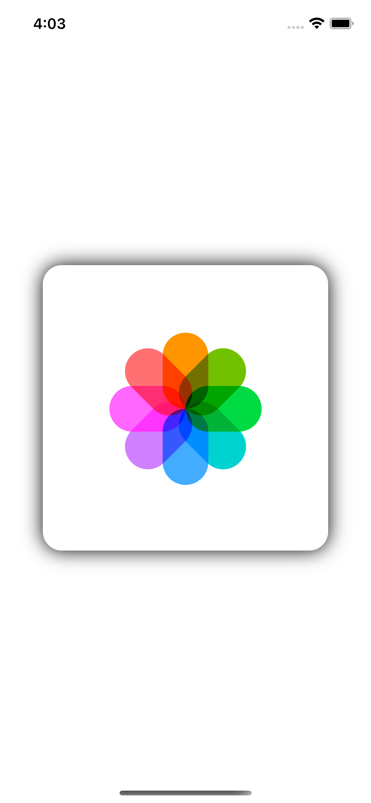

# Photos App Icon
Photos icon built with SwiftUI, distribute different colors to rotated copies using hue rotation.

# Menu
* [Screenshots](#screenshots)
* [Source](#source)
* [Contributions](#contributions)
* [Contact](#contact)

# Screenshots

# Source
Tutorials: [Amos Gyamfi](https://twitter.com/amos_gyamfi).

# Contributions

* All kinds of contributions (enhancements, new features, documentation & code improvements, issues & bugs reporting & todo task) are welcome. Let's make it better.

# Contact
Created by [Terry Kuo](https://twitter.com/ArgonYoYo) - feel free to contact me!
